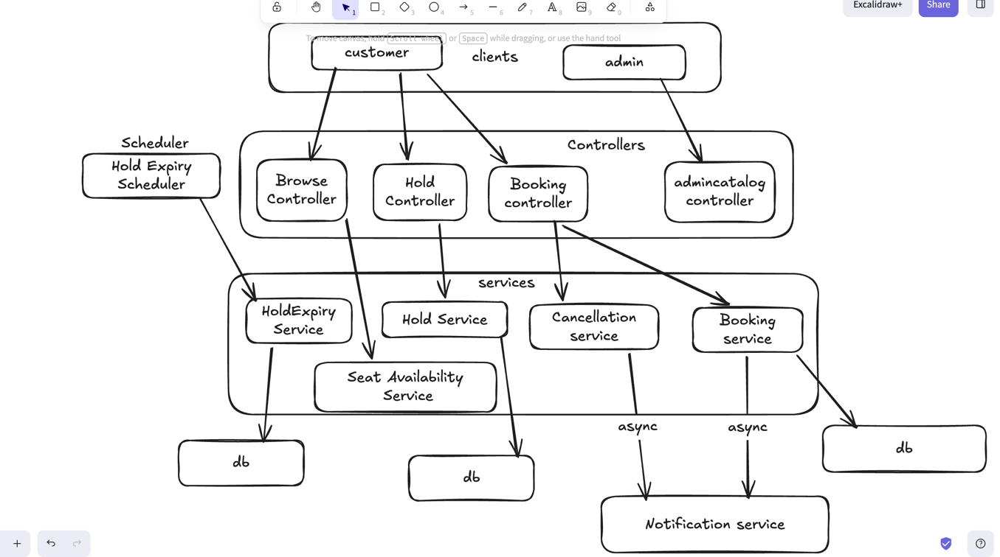

# Movie Ticket Booking System

This assignment is focused on seat holds, concurrent booking safety, idempotent payment, and hold expiry.

---

## Core flows

```
Browse show seats → Hold seats (TTL) → Confirm booking (+ optional discount) → Cancel with refund
```

### 1. Seat holds with expiry

- Customer holds one or more seats on a **specific show** for **5 minutes** (configurable).
- Holds are stored as `SeatHold` + `SeatHoldItem` rows with an `expiresAt` timestamp.
- A background job runs every **30 seconds** and marks expired holds as `EXPIRED`, releasing seats.
- On booking confirm, the hold is re-checked for expiry before payment.

### 2. Concurrency — no double booking

Seat locking targets **`show_seats`** (show→seat allocation rows), not raw theater layout seats:

1. **Hold create:** `SELECT … FOR UPDATE` on `show_seats` for `(showId, seatIds)`, then verify no other active hold or confirmed booking exists for those seats on this show.
2. **Book confirm:** pessimistic lock on the hold row, re-lock `show_seats`, re-validate availability (excluding the caller's own hold).
3. **Secondary safety:** `@Version` on `SeatHold` and `Booking` for optimistic conflicts.

Availability is **derived per show** from active holds + confirmed bookings — there is no mutable `seat.status` column.

### 3. Idempotent booking confirm

Pass `Idempotency-Key` header on `POST /api/v1/bookings`. Retries with the same key return the existing booking (HTTP 200) instead of creating a duplicate charge.

Also handles the case where a hold was already converted but the client retries.

### 4. Async notifications (log-only)

Confirmation, cancellation, and refund notifications run via `@Async` and log to the console — **no DB table**, no blocking the booking path.

---

## Tech stack

| Layer | Choice |
|-------|--------|
| Java 17, Spring Boot 3.3 | Web MVC, JPA, Validation |
| H2 in-memory | `ddl-auto: update` / `create-drop` |
| Spring Security | Header-based RBAC via `X-User-Id` (external user service assumed) |
| Springdoc | Swagger UI at `/swagger-ui.html` |

---

## Running locally

```bash
mvn spring-boot:run    # http://localhost:8080
mvn test
```

H2 console: http://localhost:8080/h2-console 

Swagger URL: http://localhost:8080/swagger-ui/index.html

---

## Key APIs

### Browse (public)

| Method | Endpoint | Description |
|--------|----------|-------------|
| GET | `/api/v1/browse/shows/{showId}/seats` | Seats with `AVAILABLE` / `HELD` / `BOOKED` for this show |

### Holds (customer)

| Method | Endpoint | Description |
|--------|----------|-------------|
| POST | `/api/v1/shows/{showId}/holds` | Hold seats (locks `show_seats` rows) |
| GET | `/api/v1/holds/{holdId}` | View hold |
| DELETE | `/api/v1/holds/{holdId}` | Cancel hold |

### Bookings (customer)

| Method | Endpoint | Description |
|--------|----------|-------------|
| POST | `/api/v1/bookings` | Confirm from hold — supports `Idempotency-Key` header |
| POST | `/api/v1/bookings/{id}/cancel` | Cancel + refund |

### Admin catalog

`/api/v1/admin/**` — cities, theaters, seats, shows, pricing tiers, refund policies, discount codes. Creating a show auto-allocates all theater seats into `show_seats`.

---

## Example: hold → book

```bash
# Hold seat 1 on show 1 (customer user id e.g. 2)
curl -X POST http://localhost:8080/api/v1/shows/1/holds \
  -H "X-User-Id: 2" -H "Content-Type: application/json" \
  -d '{"seatIds": [1]}'

# Confirm with idempotency key
curl -X POST http://localhost:8080/api/v1/bookings \
  -H "X-User-Id: 2" \
  -H "Idempotency-Key: order-abc-123" \
  -H "Content-Type: application/json" \
  -d '{"holdId": 1, "discountCode": "SAVE10"}'
```

---

## Configuration

| Property | Default | Description |
|----------|---------|-------------|
| `booking.hold.duration-minutes` | `5` | Hold TTL |
| `booking.hold.expiry-check-interval-ms` | `30000` | Expiry job interval |
| `booking.payment.simulate-failure` | `false` | Force payment failure for testing |

---

## Assumptions

1. User identity and roles come from an external user service (`X-User-Id` is a take-home shortcut).
2. Theater seats are allocated to each show via `show_seats`; holds/books lock allocation rows for that show.
3. Payment and refunds are simulated.
4. Currency is INR.
5. Out of scope per assignment: UI, deployment, microservices, OAuth, production observability.

Architecture Diagram

